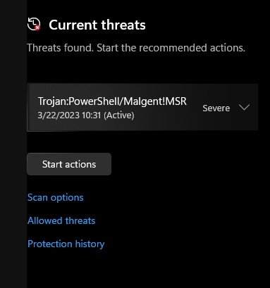
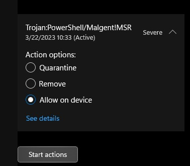
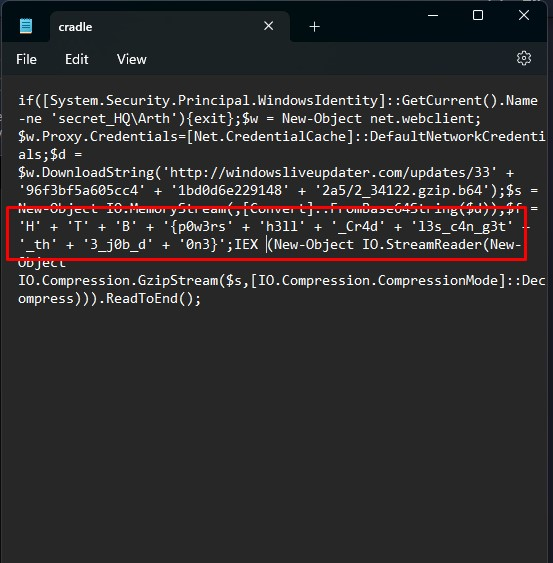
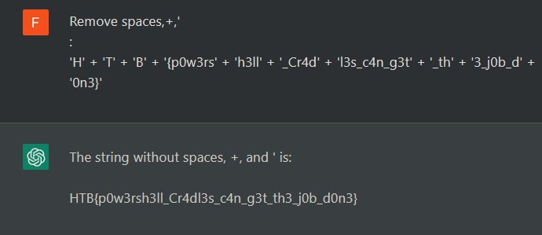

# Challenge Name: Initialise Connection 

**Category:** Pwn 
**Points:** [Point value]  
**Author:** [Your name]  
**Team:** [Your team name]  
**Completion Date:** [Date of comple7tion]

## Introduction

In an attempt for the aliens to find more information about the relic, they launched an attack targeting Pandora's close friends and partners that may know any secret information about it. During a recent incident believed to be operated by them, Pandora located a weird PowerShell script from the event logs, otherwise called PowerShell cradle. These scripts are usually used to download and execute the next stage of the attack. However, it seems obfuscated, and Pandora cannot understand it. Can you help her deobfuscate it?

## Tools Used

- PowerShell

### Step 1: Download the file

We download the provided zip file. We extract it and we have a .ps1 file that we can run it with Terminal.

### Step 2: Allow the file

The file recognized as a threat from Windows. 

So we can open it from a Virtual Machine, ensuring that we have a snapshot before open it.

In our case, because we know that it's from a trusted source, we allow it from the firewall

### Step 3: Run the .ps1 file

Now we can double click the .ps1 file or we can use terminal and type ".\cradle.ps1" 

## Flag Capture

cradle.ps1 open for us the Notepad. In the Notepad we can see the flag with spaces, plus symbol, brackets etc

We can decode it by remove these extra spaces etc and the result is:

HTB{p0w3rsh3ll_Cr4dl3s_c4n_g3t_th3_j0b_d0n3}

