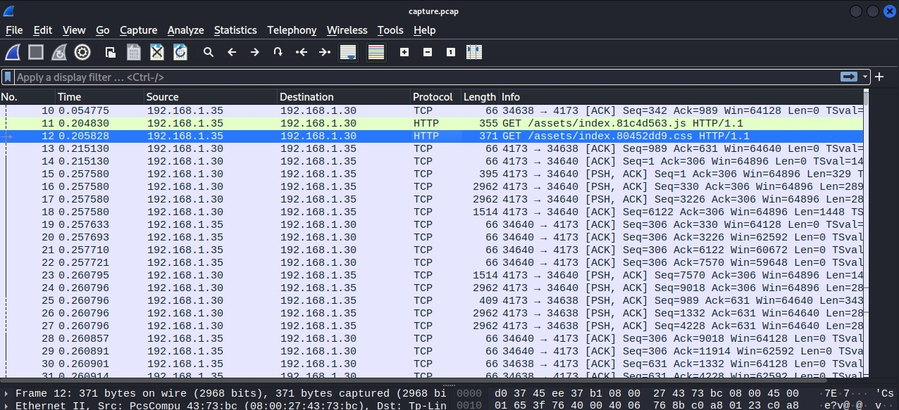
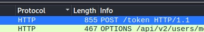
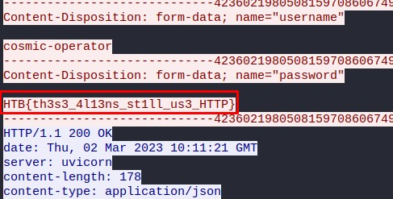

# Challenge Name: Plaintext Tleasure

**Category:** Forensics 
**Points:** [Point value]  
**Author:** [Your name]  
**Team:** [Your team name]  
**Completion Date:** [Date of comple7tion]

## Introduction

Threat intelligence has found that the aliens operate through a command and control server hosted on their infrastructure. Pandora managed to penetrate their defenses and have access to their internal network. Because their server uses HTTP, Pandora captured the network traffic to steal the server's administrator credentials. Open the provided file using Wireshark, and locate the username and password of the admin.

## Tools Used

- Wireshark

### Step 1: Download the file

We download the provided zip file. We extract it and we have a .pcap file that we can run it with Wireshark.

### Step 2: Open Wireshark and insert the .pcap file

### Step 3: Sort the packets with HTTP as a term

Sort the packets by select an HTTP packet and double click the Protocol or search for HTTP.
Then locate the POST /token packet:

## Flag Capture

Right click on the packet and Follow HTTP Stream:

HTB{th3s3_4l13ns_st1ll_us3_HTTP}
