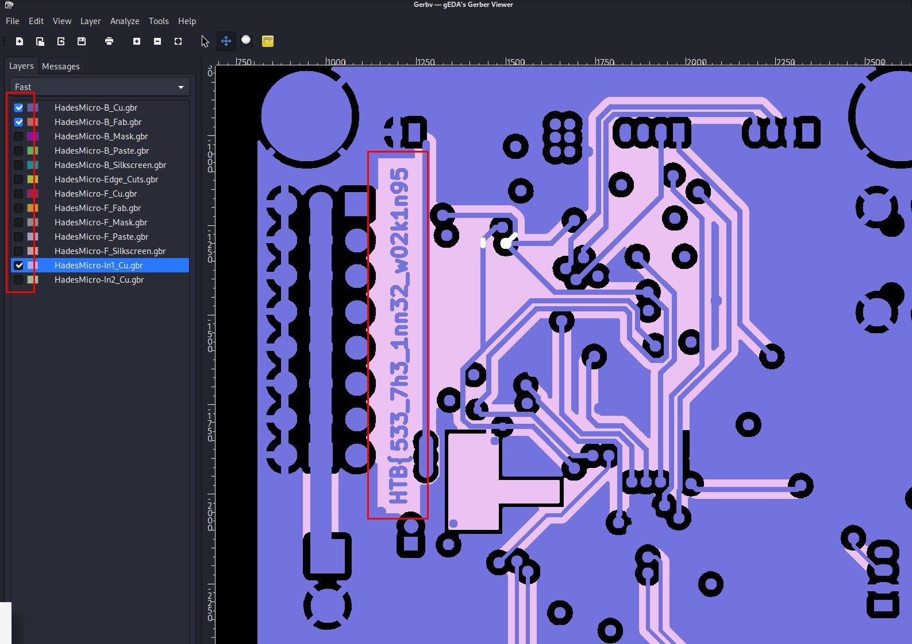
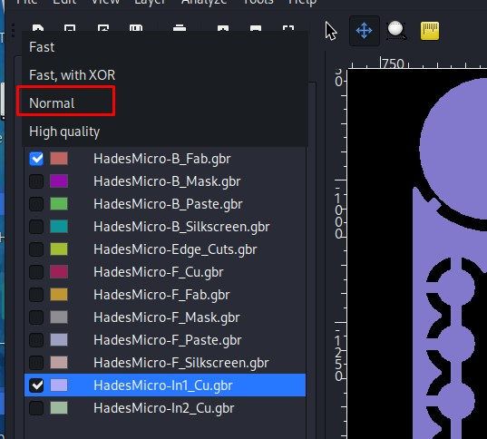
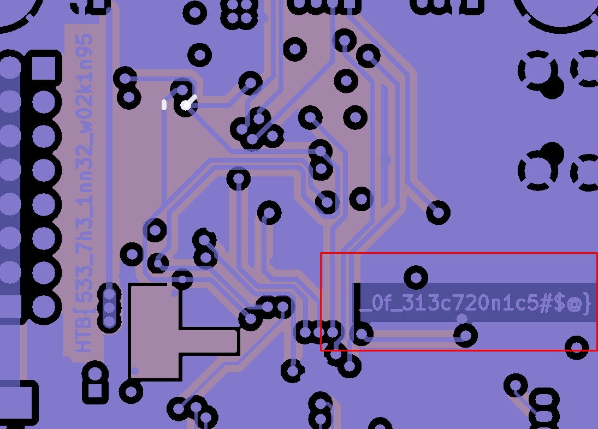

# Challenge Name: Critical Flight

**Category:** Hardware  
**Points:** 300  
**Author:** iR1d3Sc3nT  
**Team:** RAVEN CyberSec  
**Completion Date:** 21/03/2023

## Introduction

Your team has assigned you to a mission to investigate the production files of Printed Circuit Boards for irregularities. This is in response to the deployment of nonfunctional DIY drones that keep falling out of the sky. The team had used a slightly modified version of an open-source flight controller in order to save time, but it appears that someone had sabotaged the design before production. Can you help identify any suspicious alterations made to the boards?

## Tools Used

- Gerbv - Kali Linux

### Step 1: Download the Files
We download the zip file and extract it.
We can see that the folder contain files with suffix .gbr

### Step 2: Install Gerbv on Kali Linux
We use the command:
    sudo apt-get install gerbv

after the program is installed, we launch it and open all the .gbr files inside.

### Step 3: Find the first part of the flag

After we import the 12 layers of the hardware, we try different combination, by uncheck some layers, until we found the first part of the flag:

### Step 4: Find the second part of the flag

As we can see above, this is the first part of the flag because there is not a close bracket.
So after we change the rendering mode of layers from Fast to Normal:

We can see the second part of the flag waiting for us:

## Flag Capture

We combine the two parts of the flag and submit it:

HTB{533_7h3_1nn32_w02k1n95_0f_313c720n1c5#$@}

